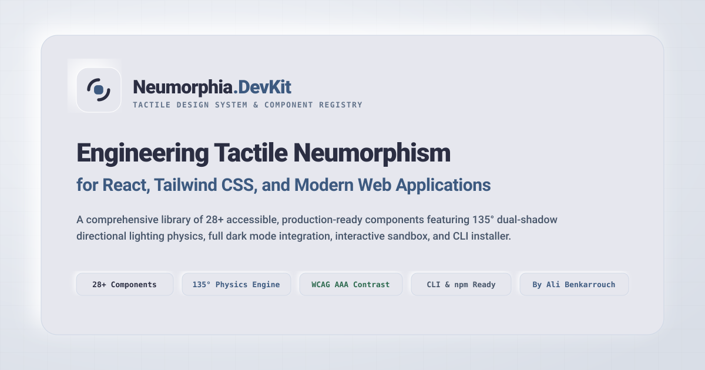

<div align="center">
  

  # Neumorphia DevKit
  ### Neumorphic (Soft UI) Components for React &amp; Tailwind CSS

  <p align="center">
    <a href="https://neumorphia-devkit.vercel.app"><strong>Live Documentation &amp; Sandbox »</strong></a>
  </p>

  <p align="center">
    <a href="https://www.npmjs.com/package/neumorphia-devkit"></a>
    
    
    
    
  </p>
</div>

---

## Overview

**Neumorphia DevKit** is a simple, copy-paste component library for React and Tailwind CSS. It gives you clean, tactile Soft UI components that you can drop directly into your own projects.

- **28+ Components**: Buttons, sliders, switches, tabs, cards, modals, gauges, and more.
- **Light &amp; Dark Mode**: Built-in support for dark mode with soft shadows and readable text contrast.
- **Easy CLI or Copy-Paste**: Add components via `npx neumorphia-devkit add <component>` or copy the source code directly from the website.
- **Zero Heavy Dependencies**: Clean TypeScript React code with Tailwind CSS classes that you own and can edit anytime.

---

## CLI Quickstart

You can add any component directly to your project using the CLI:

```bash
# npm
npx neumorphia-devkit add <component-name>

# pnpm
pnpm dlx neumorphia-devkit add <component-name>

# bun
bunx neumorphia-devkit add <component-name>
```

### Examples
```bash
npx neumorphia-devkit add button
npx neumorphia-devkit add range-slider
npx neumorphia-devkit add gauge
npx neumorphia-devkit add tabs
```

You can also download components directly with `curl`:
```bash
curl -o src/components/ui/Button.tsx https://raw.githubusercontent.com/ben4ali/Neumorphia.DevKit/main/src/registry/components/Button.tsx
```

---

## Manual Setup

### 1. Install Supporting Packages
```bash
npm install lucide-react framer-motion clsx tailwind-merge
```

---

### 2. Add CSS Variables
Add the base shadow and color variables to your `src/index.css` (or `app/globals.css`):

```css
@tailwind base;
@tailwind components;
@tailwind utilities;

:root {
  /* Light Mode */
  --nms-bg-color: #e6e7ee;
  --nms-hover-bg: #b7bdc6;
  --nms-delete-bg: #eee6e6;
  --nms-text-color: #2b2e42;
  --nms-input-text: #44476A;
  --nms-border-color: #D1D9E6;
  --nms-focus-border: #9fb3db;

  /* Shadows */
  --nms-shadow-dark: #b8b9be;
  --nms-shadow-light: #ffffff;

  /* Colors */
  --nms-info-color: #3d5a80;
  --nms-success-color: #2d6a4f;
  --nms-warning-color: #8c6227;
  --nms-danger-color: #9e3b47;
  --nms-secondary-color: #3d5a80;
}

:root.dark, html.dark, body.dark, .dark {
  /* Dark Mode */
  --nms-bg-color: #1a1a1a;
  --nms-hover-bg: #2d2d2d;
  --nms-delete-bg: #2a1a1a;
  --nms-text-color: #f1f3f5;
  --nms-input-text: #e0e2e6;
  --nms-border-color: rgba(255, 255, 255, 0.035);
  --nms-focus-border: #5b7db1;

  /* Shadows */
  --nms-shadow-dark: #0a0a0a;
  --nms-shadow-light: #282828;

  /* Colors */
  --nms-info-color: #7aa2dc;
  --nms-success-color: #68b684;
  --nms-warning-color: #d8a952;
  --nms-danger-color: #d97078;
  --nms-secondary-color: #7aa2dc;
}
```

---

### 3. Add Tailwind Config
In your `tailwind.config.ts`, add the shadow and color tokens:

```ts
import type { Config } from 'tailwindcss';

export default {
  content: ['./index.html', './src/**/*.{js,ts,jsx,tsx}'],
  darkMode: 'class',
  theme: {
    extend: {
      colors: {
        neo: {
          base: 'var(--nms-bg-color)',
          surface: 'var(--nms-bg-color)',
          well: 'var(--nms-hover-bg)',
          primary: 'var(--nms-text-color)',
          border: 'var(--nms-border-color)',
          focus: 'var(--nms-focus-border)',
          secondary: 'var(--nms-secondary-color)',
          info: 'var(--nms-info-color)',
          success: 'var(--nms-success-color)',
          warning: 'var(--nms-warning-color)',
          danger: 'var(--nms-danger-color)',
        },
      },
      boxShadow: {
        'neo-raised-sm': '3px 3px 6px var(--nms-shadow-dark), -3px -3px 6px var(--nms-shadow-light)',
        'neo-raised-md': '6px 6px 12px var(--nms-shadow-dark), -6px -6px 12px var(--nms-shadow-light)',
        'neo-raised-lg': '9px 9px 18px var(--nms-shadow-dark), -9px -9px 18px var(--nms-shadow-light)',
        'neo-inset-sm': 'inset 2px 2px 4px var(--nms-shadow-dark), inset -2px -2px 4px var(--nms-shadow-light)',
        'neo-inset-md': 'inset 4px 4px 8px var(--nms-shadow-dark), inset -4px -4px 8px var(--nms-shadow-light)',
        'neo-inset-lg': 'inset 6px 6px 14px var(--nms-shadow-dark), inset -6px -6px 14px var(--nms-shadow-light)',
      },
      borderRadius: {
        'neo-control': '0.55rem',
        'neo-badge': '0.25rem',
        'neo-card': '0.75rem',
        'neo-card-lg': '1.0rem',
        'neo-pill': '9999px',
      },
      fontFamily: {
        sans: ['"Nunito"', '"Nunito Sans"', 'system-ui', 'sans-serif'],
        mono: ['"JetBrains Mono"', 'monospace'],
      },
    },
  },
  plugins: [],
} satisfies Config;
```

---

## Component List

| Category | Components |
| :--- | :--- |
| **Actions** | `Button`, `PushButton` |
| **Forms &amp; Inputs** | `Input`, `Textarea`, `Select`, `Switch`, `Checkbox`, `Radio`, `Slider`, `RangeSlider`, `PinInput`, `Kbd` |
| **Navigation** | `Tabs`, `Accordion`, `Dock`, `Pagination`, `Stepper` |
| **Feedback** | `Progress`, `Gauge`, `Divider`, `Alert`, `Badge`, `StatCard`, `Skeleton` |
| **Surfaces &amp; Overlays** | `Card`, `Dialog`, `Tooltip`, `Avatar`, `DropdownMenu`, `Toast` |

---

## How Neumorphism Works

Neumorphic elements use two shadows from a top-left light angle:
- A light highlight on the top-left
- A dark shadow on the bottom-right

```text
       Light (top-left)
              \
               \    [Top-Left Highlight]
                v  +-------------------------------------+
                   |                                     |
                   |           NEUMORPHIC SHAPE          |
                   |                                     |
                   +-------------------------------------+
                    [Bottom-Right Dark Shadow]
```

### Shadow Levels
- **Raised (`shadow-neo-raised-md`)**: Used for clickable buttons, cards, and dropdowns.
- **Inset (`shadow-neo-inset-sm`)**: Used for text inputs, checkboxes, and toggle tracks.

---

## Author &amp; Credits

Created and maintained by **Ali Benkarrouch**:
- GitHub: [@ben4ali](https://github.com/ben4ali)
- Repository: [https://github.com/ben4ali/Neumorphia.DevKit](https://github.com/ben4ali/Neumorphia.DevKit)
- npm: [https://www.npmjs.com/package/neumorphia-devkit](https://www.npmjs.com/package/neumorphia-devkit)

---

## License

MIT License. Free to use in personal and commercial projects.
